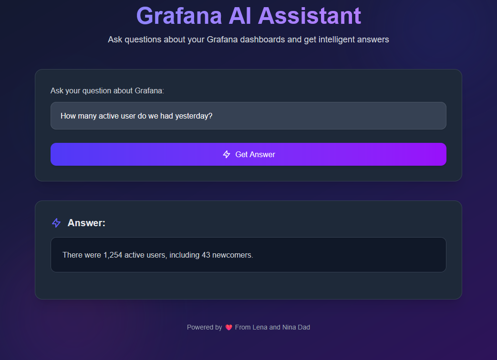

# Grafana AI Assistant

<div align="center">
  
  <p><em>Intelligent natural language interface for your Grafana dashboards</em></p>
</div>

[](https://nextjs.org/)
[](https://reactjs.org/)
[](https://genkit.ai/)
[](https://ai.google.dev/)
[](LICENSE)

## 🌟 Overview

Grafana AI Assistant is a powerful tool that allows you to interact with your Grafana dashboards using natural language. Simply ask questions about your metrics and data, and the AI will generate appropriate queries, execute them against your Grafana datasources, and provide human-readable interpretations of the results.

No more struggling with complex query languages or digging through multiple dashboards to find the information you need. Just ask your question in plain English, and let Grafana AI Assistant do the work for you.

## ✨ Features

- **Natural Language Interface**: Ask questions about your metrics in plain English
- **Multi-Datasource Support**: Works with various Grafana datasources:
  - Prometheus
  - InfluxDB
  - Loki
  - PostgreSQL, MySQL, MSSQL
  - And more!
- **Intelligent Query Generation**: Automatically generates appropriate queries based on your question
- **Human-Readable Answers**: Interprets query results and provides clear, concise explanations
- **Streaming Responses**: Delivers answers in real-time as they're generated
- **Error Handling**: Provides helpful feedback when issues occur
- **Modern UI**: Beautiful, responsive interface with animations and dark mode support
- **Secure**: Connects to your Grafana instance using secure API keys

## 🚀 Getting Started

### Prerequisites

- Node.js 18.x or higher
- A Grafana instance with API access
- Google AI API key (for Gemini models)

### Environment Setup

Create a `.env.local` file in the root directory with the following variables:

```env
# Grafana Configuration
GRAFANA_URL=https://your-grafana-instance.com
GRAFANA_API_KEY=your-grafana-api-key

# Google AI Configuration
GOOGLE_API_KEY=your-google-ai-api-key

# Optional: Enable debug logging
DEBUG_LOGGING=false
```

### Installation

1. Clone the repository:
   ```bash
   git clone https://github.com/AshkanYarmoradi/grafana-ai.git
   cd grafana-ai
   ```

2. Install dependencies:
   ```bash
   npm install
   ```

3. Start the development server:
   ```bash
   npm run dev
   ```

4. Open [http://localhost:3000](http://localhost:3000) in your browser

### Production Deployment

Build the application for production:

```bash
npm run build
npm start
```

## 💡 Usage Examples

Here are some example questions you can ask:

- "What's the CPU usage across all servers in the last 3 hours?"
- "Show me the error rate for the payment service since yesterday"
- "How many users logged in today compared to last week?"
- "What's the 95th percentile response time for the API gateway?"
- "Show me the top 5 most memory-intensive containers"

## 🏗️ Architecture

Grafana AI Assistant is built with a modern tech stack:

- **Frontend**: Next.js 15 with React 19, using the App Router
- **UI Components**: Custom components with Tailwind CSS and Framer Motion
- **AI Integration**: GenKit AI framework with Google's Gemini 2.5 Pro models
- **API**: Next.js API routes with streaming response support

The application follows this workflow:

1. User submits a question through the UI
2. The question is sent to the `/api/grafana` endpoint
3. The `grafanaFlow` processes the question:
   - Discovers available Grafana datasources
   - Generates an appropriate query using AI
   - Executes the query against the selected datasource
   - Interprets the results using AI
4. The response is streamed back to the UI in real-time
5. The UI displays the formatted answer to the user

## 📊 API Documentation

### POST /api/grafana

Processes natural language questions about Grafana dashboards.

**Request Body:**

```json
{
  "question": "What's the CPU usage across all servers in the last hour?"
}
```

**Response:**

A streaming response containing the AI-generated answer in markdown format.

## 🤝 Contributing

Contributions are welcome! Please feel free to submit a Pull Request.

1. Fork the repository
2. Create your feature branch (`git checkout -b feature/amazing-feature`)
3. Commit your changes (`git commit -m 'Add some amazing feature'`)
4. Push to the branch (`git push origin feature/amazing-feature`)
5. Open a Pull Request

## 📄 License

This project is licensed under the MIT License - see the [LICENSE](LICENSE) file for details.

## 🙏 Acknowledgements

- [Grafana](https://grafana.com/) for their amazing observability platform
- [Google AI](https://ai.google.dev/) for their powerful Gemini models
- [GenKit](https://genkit.ai/) for their AI development framework
- [Next.js](https://nextjs.org/) for the React framework
- [Tailwind CSS](https://tailwindcss.com/) for the styling utilities
- [Framer Motion](https://www.framer.com/motion/) for the animations
